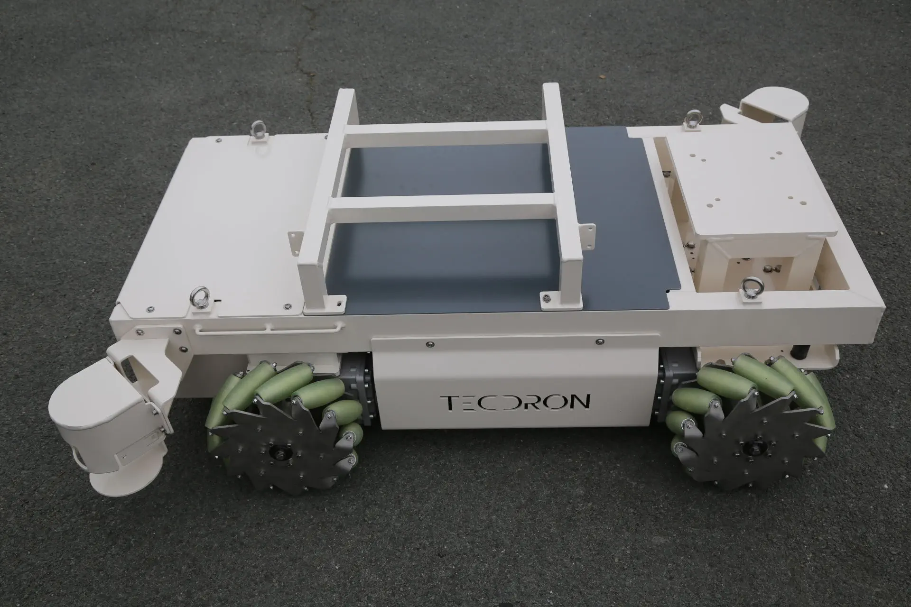
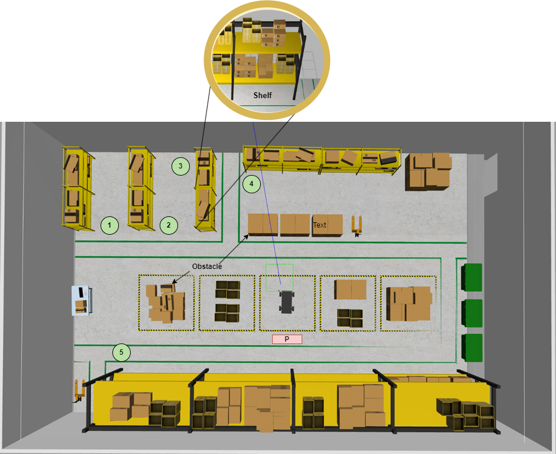
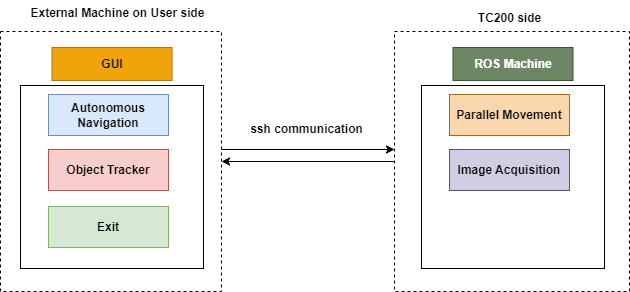
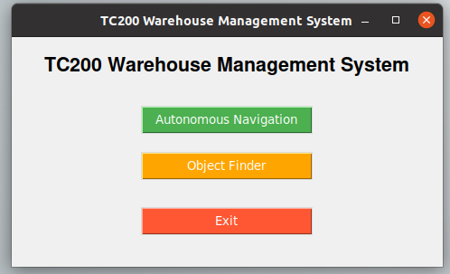
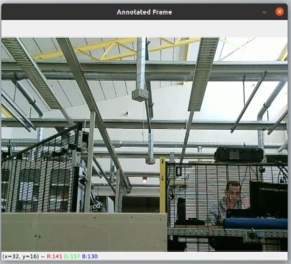
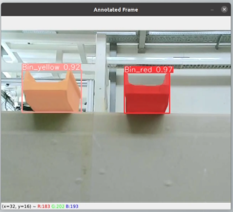

# tc200_hda
This repository contains the ROS package for the tc200 robot. The ROS package is the implementation of a warehouse management system using the holonomic TC200 robot.

## Project tree
 * [params](./params)
   * [map_nav_params](./params/map_nav_params)
   * [odom_nav_params](./params/odom_nav_params)
 * [CMakeLists.txt](./CMakeLists.txt)
 * [include](./include)
   * [tc200_hda](./include/tc200_hda)
 * [package.xml](./package.xml)
 * [launch](./launch)
   * [user.launch](./launch/user.launch)
 * [maps](./maps)
 * [src](./src)
   * [user_side_scripts](./src/user_side_scripts)
     * [shelf_list](./src/user_side_scripts/shelf_list)
     * [sort.py](./src/user_side_scripts/sort.py)
     * [cv_models](./src/user_side_scripts/cv_models)
     * [object_tracker.py](./src/user_side_scripts/object_tracker.py)
     * [task_scheduler.py](./src/user_side_scripts/task_scheduler.py)
     * [main.py](./src/user_side_scripts/main.py)
     * [autonomous_navigation.py](./src/user_side_scripts/autonomous_navigation.py)
   * [tc200_scripts](./src/tc200_scripts)
   * [parallel_movement.py](./src/tc200_scripts/parallel_movement.py)
 * [tree-md](./tree-md)

## About TC200 robot
TC200 is a versatile and entirely customizable platform specifically tailored for educational and training purposes. 
It has mecanum wheels, or omnidirectional wheels which allows the robot with holonomic motion capabilities, making it exceptionally well-suited for 
asks within confined spaces with limited manoeuvring room.

## PROBLEM STATEMENT

The goal is to use the TC200 robot to find objects which are of interest to the warehouse worker. The robot is placed at a __parked position P__. When the warehouse worker needs to track/find an object of interest from the shelves, the robot helps to ease the task by going to the shelves marked with numbers (1..5) autonomously and then looking for the desired object. This saves time for the worker and also a co-dependency between the robot and human is established.

## System Diagram

The system diagram implemented for the usecase is presented above. For the proof of concept, only the bins of Red and Yellow colour were detected. When the robot is performing a task, when it detects and identifies an object of interest on the shelf, it displays some metadata that is relevant to that respective object such as the confidence score and the number of occurrences of that object.

## Run the Usecase

### CAUTION
 	

The practical usecase was implemented for the __Bathroom__ area. __In order to test the code for a new area__, it is advised that the following changes are made:

**1. Perform Mapping of the new environment**

**2. Add/update the shelf points**

__Please seek the assistance of the lab engineer to perform the above tasks.__

### Prerequisites (General):
On the User PC, do the following:

1. Git Clone this repository inside the `src` folder of your catkin workspace
   
    `git clone https://github.com/touhid-ahmed/tc200_hda.git`

2.  Compile the catkin workspace

    `cd .. `

    `catkin_make`

### Connecting to TC200 from the User Side:

1. Turn on the Robot
2. Make sure the robot is placed at its parked spot. If not, teleop the robot using the joystick
3. On the user side PC, make sure that the PC is connected to the same Wi-Fi network as the TC200. (ex: MAROON WLAN)
4. Open a new terminal in the user-side PC for connecting to the ROS machine of TC200

   `ssh tc200@192.168.XXX.XX -Y`

5. Enter the password for the network (to be provided by the lab engineer)

6. Stop the Robot service:

    `systemctl stop robot.service`

7. Source the workspace:

    `cd stdcatkin_ws/`

    `source devel/setup.bash`

8. Run the launch file for the tc200 side

    `roslaunch tc200_navigation robot_usecase.launch`

### Running the local nodes in TC200:

1. Export the __ROS MASTER URI__ to locate the master (TC200 is the ROS master for the use case)

    `export ROS_MASTER_URI=http://192.168.XXX.XX:11311`

2. source the catkin workspace of the user side:
     
    `cd <Your Catkin WS Name>/`

    `source devel/setup.bash`

   
3.  Run the launch file for the user side:

   `roslaunch tc200_hda user.launch`
   
4. A GUI will appear on the screen. Wait for the detection screen to come up as well.

   
  

5. Click on the __Object Finder__ button to start the usecase.
6. If an object is found the detected screen will display the results
   
    

7. After completing all the tasks the robot returns to its initial position.

## Acknowledgement

This research work was conducted as part of the __M02 Term Project__ during the Summer Term of 2023 under the supervision of the __Assisted Working and Automation (AWA)__ department at __Hochschule Darmstadt__.
   
